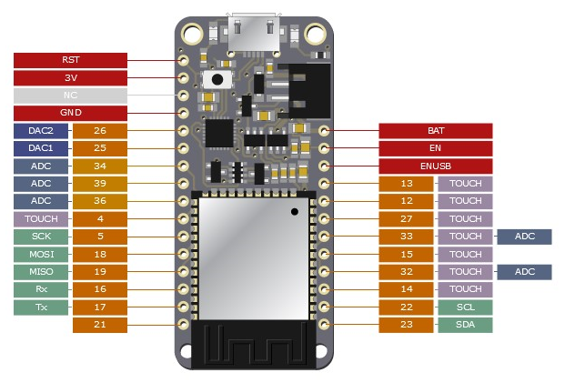
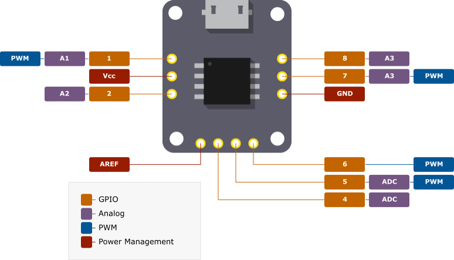

# pinout

SVG diagrams creation from Python code - **pinout** provides an easy method of creating pin-out diagrams for electronic hardware.




Please visit [pinout.readthedocs.io](https://pinout.readthedocs.io) for the latest 'getting started' guide and detailed documentation on all options provided by the *pinout* package.

## Quick start

*pinout* provides some sample files for a quick start and demonstration of key features. 

### Install

Using a virtual environment is recommended; Start by installing the *pinout* package. Either clone this repo and pip install it or install directly from github...
```
pip install git+https://github.com/j0ono0/pinout@main
```
NOTE for package upgrading: pip upgrade doesn't work from git repos! Please install again if you want to try out the latest version (*warning*: development is furious! Newer versions might not be backwards compatible).

### Duplicate sample files

A normal pinout diagram will ultimately include an SVG file, an image of hardware to be documented, and a stylesheet that provides unique styles to the diagram. Duplicate the sample files from the *pinout* package by launch Python at the location you intend to work and enter the following:
```python
from pinout import resources
resources.duplicate()

# expected output:
# >>> sample_diagram.py duplicated.
# >>> sample_hardware_board.png duplicated.
# >>> sample_styles.css duplicated.
```

Once you have these file a finished diagram can be generated by running the python script from a command line `py sample_diagram.py`. An SVG file is created and can be conveniently view in a browser.



For a detailed walk through *sample_diagram.py* and more information on *pinout* please visit [pinout.readthedocs.io](https://pinout.readthedocs.io).
