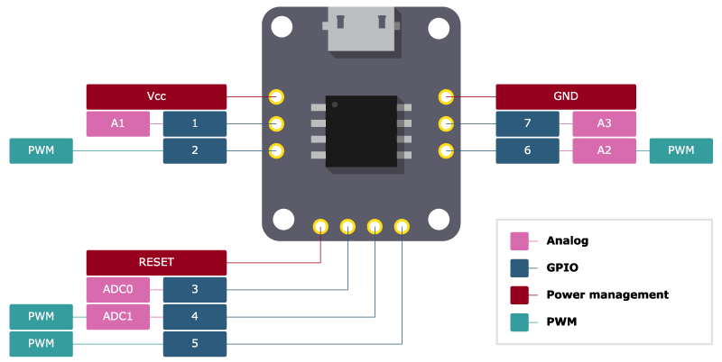

# pinout

  

SVG diagram creation from Python code - **pinout** provides an easy method of creating pin-out diagrams for electronic hardware.

<p align="center">
    
</p>

Please visit [pinout.readthedocs.io](https://pinout.readthedocs.io) for the full *quick start* tutorial and detailed documentation on all options provided by the *pinout* package.

## Quick start

*pinout* can be easily installed with pip and provides some sample files that demonstrate key features. 

### Install

Using a virtual environment is recommended; Start by installing the *pinout* package. Either clone this repo and pip install it or install from PyPi:
```
pip install pinout

# Or upgrade to the latest version
pip install --upgrade pinout
```

### Duplicate sample files

A normal pinout diagram will ultimately include an SVG file, an image of hardware to be documented, and a stylesheet that provides unique styles to the diagram. Duplicate the sample files from the *pinout* package by launch Python at the location you intend to work and enter the following:
```python
from pinout import resources
resources.duplicate('get started')

# expected output:
# >>> quick_start_board.png duplicated.
# >>> quick_start_config.yaml duplicated.
# >>> quick_start_pinout.py duplicated.
# >>> quick_start_styles.css duplicated.
```

Once you have these file a finished diagram can be generated by running the python script from a command line `py quick_start_pinout.py`. An SVG file is created and can be conveniently view in a browser.



For a detailed walk through *sample_diagram.py* and more information on *pinout* please visit [pinout.readthedocs.io](https://pinout.readthedocs.io).
