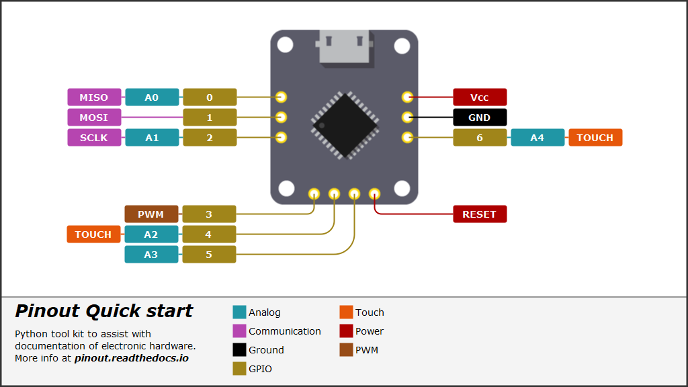

# pinout

  

SVG diagram creation from Python code - **pinout** provides an easy method of creating pin-out diagrams for electronic hardware.

<p align="center">
    
</p>

Please visit [pinout.readthedocs.io](https://pinout.readthedocs.io) for the full *quick start* tutorial and detailed documentation on all options provided by the *pinout* package.

## Quick start

*pinout* can be easily installed with pip and provides some sample files that demonstrate key features. 

### Install

Using a virtual environment is recommended; Start by installing the *pinout* package. Either clone this repo and pip install it or install from PyPi:
```
pip install pinout

# Or upgrade to the latest version
pip install --upgrade pinout
```

### Duplicate sample files

A normal pinout diagram will include a hardware image, stylesheet, data file, and a Python script. Sample files are included with the package and can be duplicated for your use. Open a command line (with enabled virtual environment if you are using one) in the location you plan to work and enter the following:
```python
py -m pinout.manager --duplicate quick_start

# expected output:
# >>> data.py duplicated.
# >>> hardware.png duplicated.
# >>> pinout_diagram.py duplicated.
# >>> styles.css duplicated.
```

Once you have these file a finished diagram can be generated by running the python script from a command line `py pinout_diagram.py`. An SVG file is created and can be conveniently view in a browser.



For a detailed walk through *pinout_diagram.py* and more information on *pinout* please visit [pinout.readthedocs.io](https://pinout.readthedocs.io).
