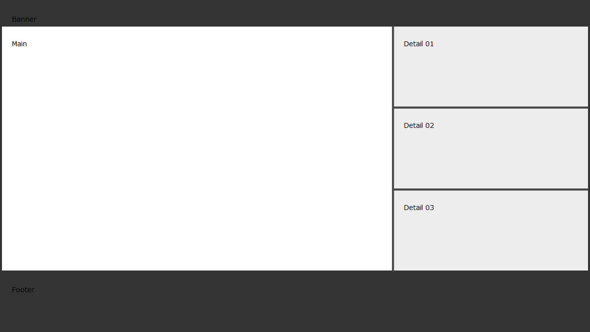

# Example: Panel layout

The Diagram and Panel classes can be directly used to create custom layouts or build upon diagram sub-classes. 

Dimensions and position of each panel can be manually calculated and entered. Alternatively, as done in this example, many of these details reference other panels. This setup allows for easier layout adjustments. As critical layout dimensions (*panel_banner.height*, *panel_main.width* and *panel_main.height*) are altered other panels automatically resize to fit. 

## Output

Now the layout has been completed further content can in added to the Panel instances creating a finished diagram featuring multiple sections (output from 'populated_layout.py').

